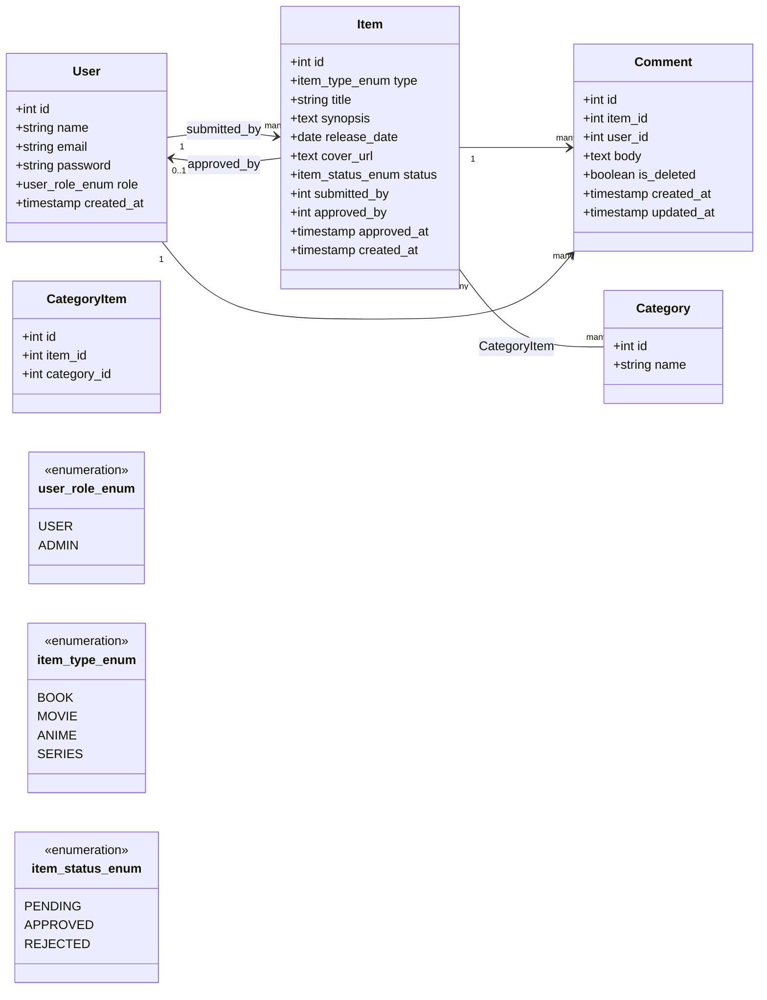

```mermaid
classDiagram
direction LR

class User {
  +int id
  +string name
  +string email
  +string password
  +user_role_enum role
  +timestamp created_at
}

class Item {
  +int id
  +item_type_enum type
  +string title
  +text synopsis
  +date release_date
  +text cover_url
  +item_status_enum status
  +int submitted_by
  +int approved_by
  +timestamp approved_at
  +timestamp created_at
}

class Category {
  +int id
  +string name
}

class CategoryItem {
  +int id
  +int item_id
  +int category_id
}

class Comment {
  +int id
  +int item_id
  +int user_id
  +text body
  +boolean is_deleted
  +timestamp created_at
  +timestamp updated_at
}

%% Enums
class user_role_enum {
  <<enumeration>>
  USER
  ADMIN
}

class item_type_enum {
  <<enumeration>>
  BOOK
  MOVIE
  ANIME
  SERIES
}

class item_status_enum {
  <<enumeration>>
  PENDING
  APPROVED
  REJECTED
}

%% Relacionamentos
User "1" --> "many" Item : submitted_by
User "0..1" <-- Item : approved_by
Item "1" --> "many" Comment
User "1" --> "many" Comment
Item "many" -- "many" Category : CategoryItem
```
